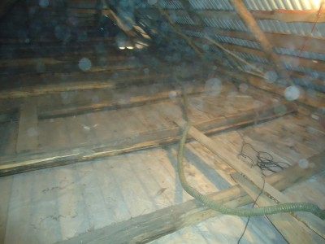
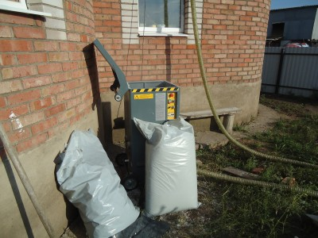
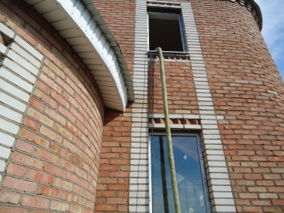
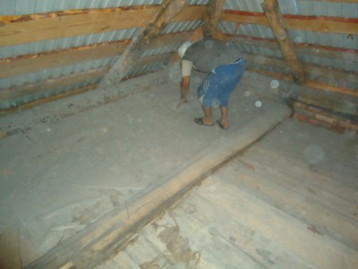
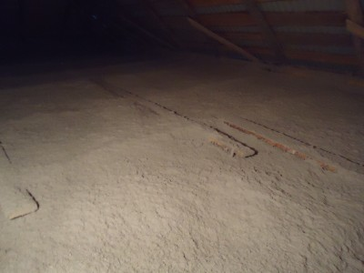

Утеплили чердак в городе Мелеуз. На первом фотографии изображен чердак до утепления эковатой.

Чердак до утепления эковатой

Утепление чердаков производится без уплотнения материала. Материал подается из выдувной машины по шлангу  на чердак.

Разрыхлительно-выдувная машина

Шланг подачи материала

По краям чердаков дополнительно утрамбовываем эковату вручную, потому что в этих местах обычно бывают зазоры. Хорошо утрамбованные края обеспечивают лучшее утепление на стыке между чердаком и стеной.

Ручная трамбовка краев

После заполнения эковаты между лагами остается ровная поверхность, как на следующей фотографии.

Утепленный чердак

На этом процесс утепления завершен.
