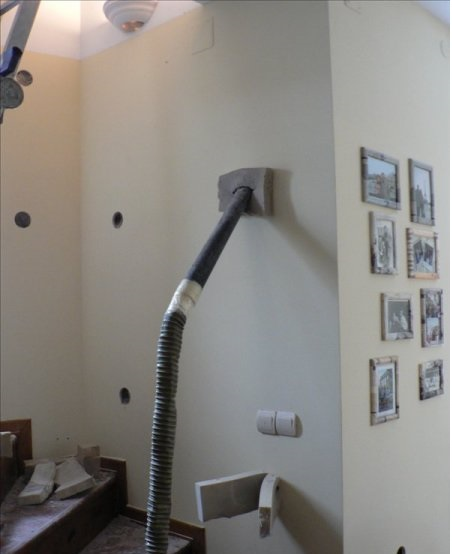
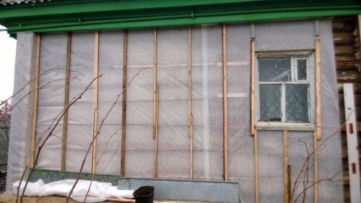
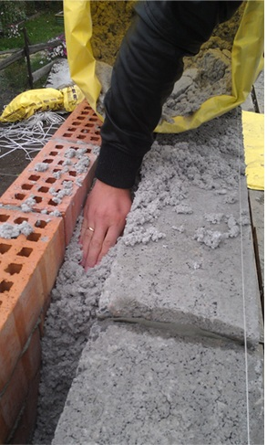

Утепление стены эковатой производят задувкой в заранее подготовленную полость: или под обшивку, или в пространство между стеной.

При утеплении стен эковатой бывают следующие ситуации:

- Утепление изнутри
- Утепление снаружи
- Утепление между стеной

Рассмотрим ниже каждую ситуацию подробнее.

## Утепление стены изнутри

Для утепления стены изнутри дома делают полость из гипсокартона или другой обшивки. Это делается таким образом, чтобы от стены до обшивки оставалось минимум 5 см пространства. Эковата заполняет полость между стеной и этим гипсокартоном.

На гипсокартоне делается отверстие, через которое задувается эковата. Такие отверстия делаются в нескольких местах, чтобы можно было контролировать за тем, что все участки стены утеплены.

## Утепление стены снаружи

Снаружи дома все делается также, но с небольшими различиями.

Сначала собирается каркас. На рисунке ниже видно, что между изоспаном и стеной оставили зазор для задувания туда эковаты. Изоспан после утепления эковатой закрывается любой внешней обшивкой. Между изоспаном и этой обшивкой желательно оставлять рейку в роли вентзазора.

На следующем видео виден процесс заполнения этой полости эковатой. Видео длится недолго, всего 14 секунд.

Конечно, на видео показан только начальный этап заполнения эковаты. На этом процесс утепления не заканчивается. Далее все проверяется на достаточную плотность заполнения и в местах, где не достаточно, задувается еще.

## Заполнение эковаты между стеной

Эковату заполняют между брусом и кирпичом или между двумя кирпичами. Могут быть и другие варианты заполнения утеплителя, главное, чтобы была ниша для задувания.

Заполнение утеплителя можно делать и вручную. Но при утеплении ручным способом невозможно заполнить эковату с нужной плотностью и заполнить все отдаленные участки. Даже если проталкивать и трамбовать палкой, это невозможно сделать качественно. При машинном способе утепления материал доставляется по шлангу до нужного места и там уже с помощью потока воздуха заполняет все уголки и все щели.

Ручной способ подойдет, если укладывать эковату параллельно с кирпичной кладкой, хорошо утрамбовывая каждый слой или если высота стены невысокая, то тут тоже подойдет ручной способ укладки. Однако для обеспечения плотности и заполнения без щелей и зазоров все же предпочтительнее использовать машинный способ.
