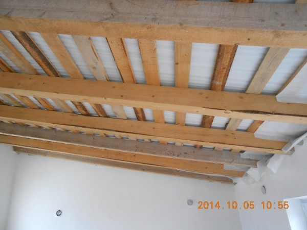
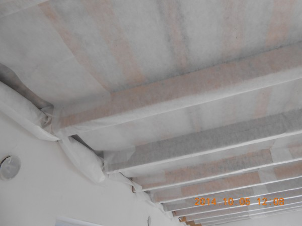
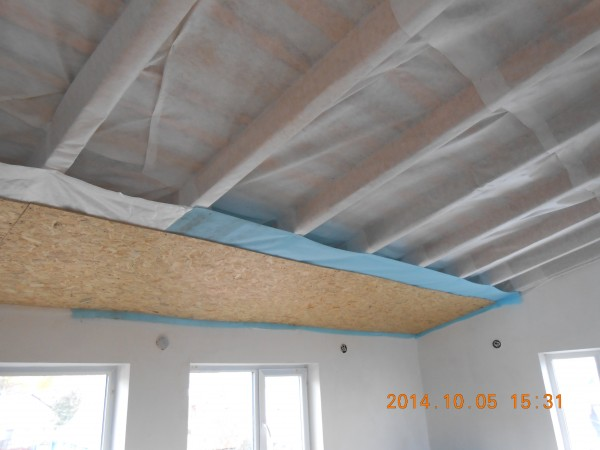
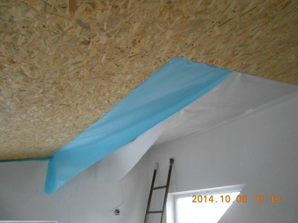

Крыша, которую мы утепляли, одновременно является крышей и черновым потолком. Вот так выглядит эта крыша.

Первым делом обшивали изоспаном со стороны крыши. Этого делать не обязательно, но по просьбе хозяина это сделали.

После этого крыша обшивается изоспаном со стороны потолка и закрывается ОСП. Как видно из рисунка ниже, остается зазор между крышей и ОСП для заполнения туда эковаты.

Заполнение в образовавшиеся полости производили постепенно. Это нужно для того, чтобы обеспечивать высокую плотность заполнения эковаты. Сначала крепим один лист ОСП, заполняем эковату, потом второй лист, заполняем эковату. И так далее.

Дальнейшая работа по такому же сценарию.

