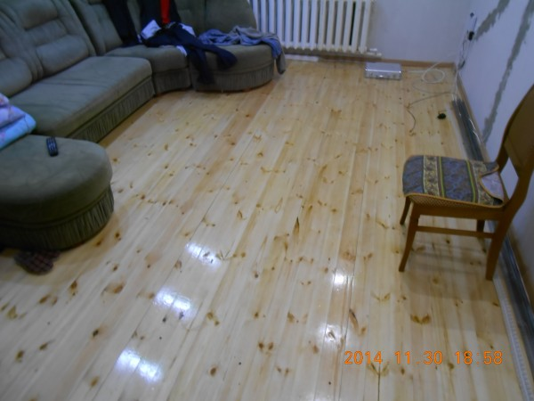
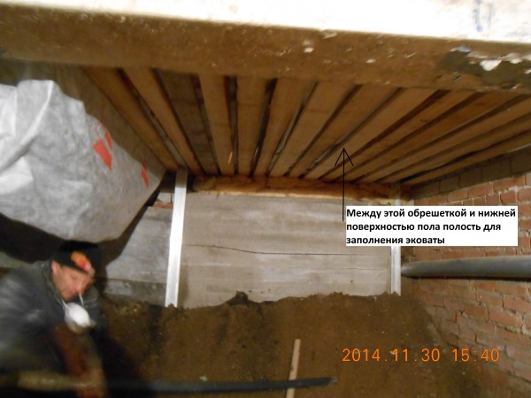
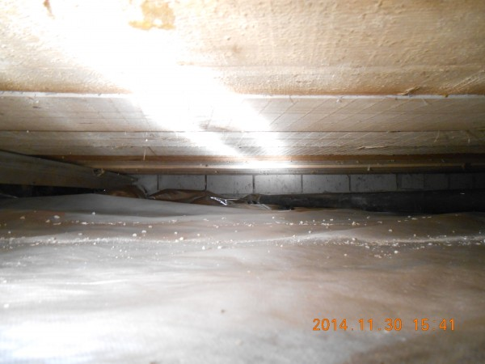
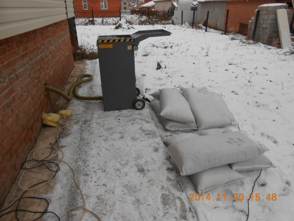

Здравствуйте. Сегодня первый день зимы 2014 года. Вчера утеплили пол эковатой в городе Стерлитамак. Вот так этот пол выглядит сверху.

Но утепляли мы этот пол снизу из подвала.

Стрелкой показана обрешетка, которая находится на расстоянии около 20 см от низа пола. Эта обрешетка сверху накрыта изоспаном.

Полость изнутри выглядит вот так.

После заполнения эковаты я результата не видел, но измерив температуру сразу после утепления заметили повышение температуры пола с 18 до 20 градусов, но скорее всего позже она повысилась, потому что в своем доме у нас температура утепленного пола около 22 градусов и в середине комнаты и по краям.

А вот так выглядит процесс нашей работы снаружи, со стороны улицы, где загружаем эковату в разрыхлительно-выдувную машину.

Эковата, которая валяется в мешках, привезена из Перми. Качество хорошее, пробовал поджечь — не горит, а это значит, что добавки смешаны хорошо. Мы всегда работаем или с Пермской или с Чебоксарской эковатой, потому что проверили их надежность и доверяем им.

Если есть вопросы, звоните. Мы можем приехать и на месте посмотреть возможность утепления в вашей ситуации и подсказать, насколько это будет целесообразно.
